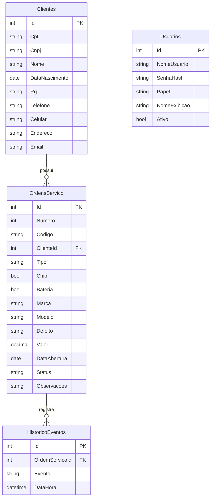

# Diagrama ER

```mermaid
erDiagram
    Clientes ||--o{ OrdensServico : possui
    OrdensServico ||--o{ HistoricoEventos : registra

    Clientes {
        int Id PK
        string Cpf
        string Cnpj
        string Nome
        date DataNascimento
        string Rg
        string Telefone
        string Celular
        string Endereco
        string Email
    }

    OrdensServico {
        int Id PK
        int Numero
        string Codigo
        int ClienteId FK
        string Tipo
        bool Chip
        bool Bateria
        string Marca
        string Modelo
        string Defeito
        decimal Valor
        date DataAbertura
        string Status
        string Observacoes
    }

    HistoricoEventos {
        int Id PK
        int OrdemServicoId FK
        string Evento
        datetime DataHora
    }

    Usuarios {
        int Id PK
        string NomeUsuario
        string SenhaHash
        string Papel
        string NomeExibicao
        bool Ativo
    }
```

`Usuarios` não tem relacionamento com as demais tabelas — autenticação é independente do domínio de negócio (não há rastreamento de "quem atendeu" cada OS).
